# Data Analytics Power BI Report

The purpose of this project was to build a series of report pages for a retailer to highlight some insights into their business in order to help build their business intelligence. 

In this README, I'll go over how I achieved each milestone.

In order to view the file in Power BI, simply download 'project.pbix' from the repo and open in Power BI. 

## Milestone 1 

Simply setting up the GitHub repository for the project

## Milestone 2

This involved loading all the necessary tables into Power BI. Loading the Orders table involved connecting to the Azure SQL Database. Once I had the table, I split up the [Order Date] and [Shipping Date] columns into one for the date and one for the time. 

For the Products table, I had to download a .csv file and load it into Power BI. To clean up the (weight) column, I had to split this into the weight and the units. Using columns from examples, this was easily achieved. I did have to note some of the edge cases and manually fix them (for example, one of the weights was a multipack and I only had the weight of an individual product, so I had to multiply the number of products in the multipack with the number of items present).

For the Stores table, I had to connect to a blob storage to import the table, which was a simple process. 

Finally, the Customers table just came as a .zip file, so after loading this into Power BI, it automatically appended the 3 files present inside.

## Milestone 3

This involved creating the data model. The first step was to create the date table, which ran from the earliest date in the [Order Date] column to the final date in the [Shipping Date] column. To make sure I had the correct dates, I first went to the [Order Date] column and sorted by ascending to find the first date and make note of the date. I did the same for the [Shipping Date] but sorted by descending to get the most recent date. Now I could make my dates table using the expression 

```dax 
Dates = CALENDAR(DATE(2010,1,1), DATE(2022,31,12))
```
The next step was to build the Star Schema model. Here is the completed model: 

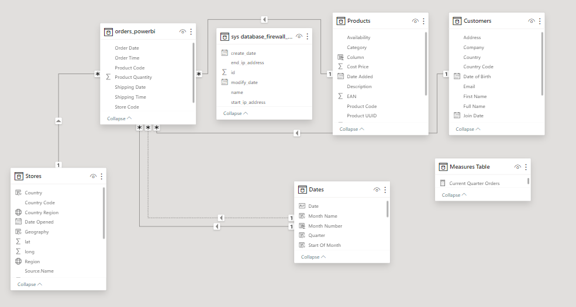

Next, I had to create a measures table for the key measures. These were the following:

```dax
Total Orders = COUNT(orders_powerbi[Order Date])

Total Revenue = SUMX(orders_powerbi, orders_powerbi[Product Quantity]* RELATED(Products[Sale Price]))

Total Profit = SUMX(orders_powerbi, orders_powerbi[Product Quantity]*'Measures Table'[Profit])

Total Customers = COUNTROWS(SUMMARIZE(orders_powerbi, orders_powerbi[User ID]))

Total Quantity = COUNT(orders_powerbi[Order Date])

ProfitYTD = TOTALYTD([Total Profit], orders_powerbi[Order Date])

RevenueYTD = TOTALYTD([Total Revenue], orders_powerbi[Order Date])
```

With the name of each measure being self-explanatory in what it's purpose is.

Finally, I had to create a date and geography hierarchy. The date hiearchy was quite simple, and the levels were:

- Start of Year
- Start of Quarter
- Start of Month
- Start of Week
- Date

The geography hierarchy has the levels:

- World region
- Country
- Country Region

## Milestone 4

Here I just set up the report by creating the pages and adding an empty navigation sidebar.

## Milestone 5 - Executive Summary page

I first created the Headline Card Visuals which would contain the number of Unique Customers and the Revenue per Customer. I arranged two rectangles in the top corner, and then put the card visuals on top of them, creating simple yet clear visuals.

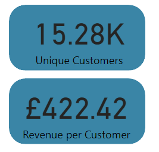

The next was to create a donut chart showing the customers per country:

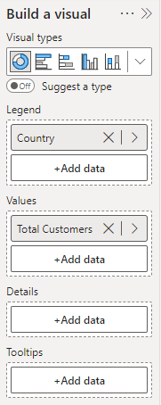

And a similar chart showing each category by number of customers

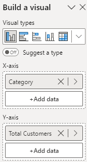

Next was a line chart which shows how many customers there are over the years. The user is then allowed to change from a yearly view to a monthly view using a drill down. There is also a forecast for the next 10 periods on the line chart, in order to estimate how the customers will change over the next few quarters:

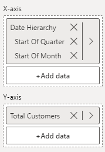 

Next was the top 20 customers table, which shows which customers have contributed most to the revenue for the company. These were the columns I used:

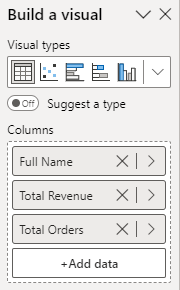

I then chose to Sort By < Total Revenue to get the customers by revenue. To only show the top 20 customers, I applied this filter to sort the names by revenue:

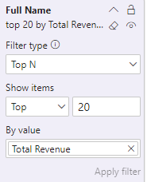

I added some more card visuals to show the top customer, their total number of orders, and the revenue they have generated. 

Finally, I created a simple date slicer so the user can filter the page year by year. This was the final page:

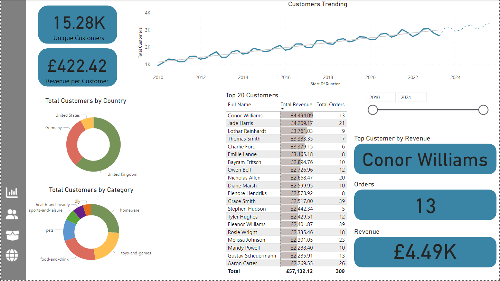

## Milestone 6 - Customer Detail Page

Firstly, I created some more card visuals for the top left corner, similarly to last time. These displayed some of the measures I created previously. These were the Total Revenue, Total Orders, and Total Orders. 

Also in a similar fashion to before, I created another line chart, but instead of showing the number of customers over time, this was for the revenue over time. 

Next, I created a pair of donut charts, showing the total revenue by the country, and for the store type, and then converted the donut chart from the previous page showing the total customers by category into a bar chart, and added these to the right side:

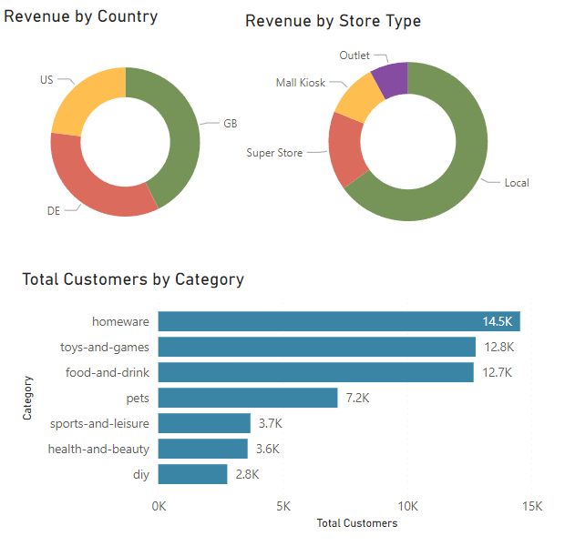

Finally were the KPI visuals. I had to create some new measures: 

```dax
Previous Quarter Revenue = CALCULATE([Total Revenue], PREVIOUSQUARTER(Dates[Date]))
Revenue Target = [Previous Quarter Revenue] * 1.05

Previous Quarter Profit = CALCULATE([Total Profit], PREVIOUSQUARTER(Dates[Date]))
Profit Target = [Previous Quarter Profit] * 1.05

Previous Quarter Orders = CALCULATE([TotalOrders], PREVIOUSQUARTER(Dates[Date]))
Orders target = [Previous Quarter Orders] * 1.05
```

I then made 3 similar KPIs to show the changes for this quarter. 

This was the completed page:

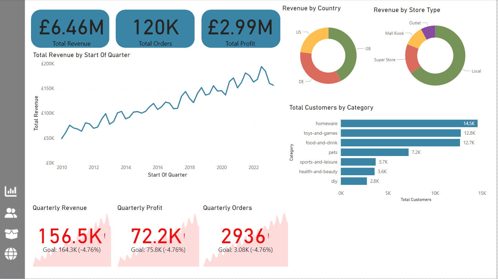

## Milestone 7 - Product Detail Page

I firstly created some gauges to show the current-quarter performance of Orders, Revenue, and Profit against a target, which would be a 10% quarter-on-quarter increase. These were set up in a similar way to the KPIs on the previous page, where all 3 gauges were very similar to each other. 

I included some conditional formatting where the callout value would show as red if the target is not yet met. I set up a rule colour section where it would show as red if we are below the maximum value as follows:

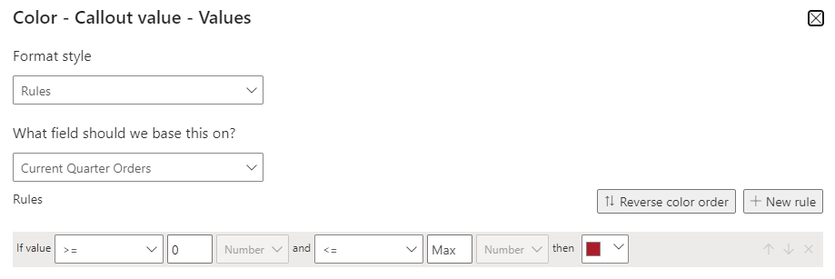

Next was an area chart, which was quite similar to the previous line graphs. The X axis has the start of the quarter, and the Y axis has the total revenue. The legend was the categories. Now we can easily see which categories are making the most revenue over time. 

In a similar fashion to other tables before, I made a top 10 products table, showing:

- Product Description
- Total Revenue
- Total Customers
- Total Orders
- Profit per Order

Note that the Profit per Order measure was created using the expression

```dax
Profit per Order = [Total Profit]/[Total Orders]
```

Next was a scatter graph showing the Orders vs. Profitability. This was set up with:

- X axis was the Profit per Item
- Y axis was the Total Quantity
- Values was the product Description
- Legend was the product Cateogry

Last was the slicer toolbar. This was so the user could specify a country and a product category, and then these would be shown on the visualizations. To do this I needed to create a bookmark. One would be where the toolbar is open, and the categories can be selected, and one where it is closed. 

To change between this, an open and back button would be implemented. Here is the open toolbar, where the slicers for the country and the category have been added:

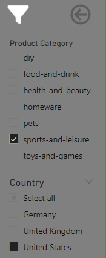

As many product categories as you want can be selected at once, but only one country at a time can be selected, unless the select all choice is selected. Once the back button was pressed, the toolbar would revert.  

The final steps was to add two cards which show which category and country were selected. This was done in a similar way to the other cards, only this time I used a live text box which would identify the current selections. Here is the final page with the toolbar closed:

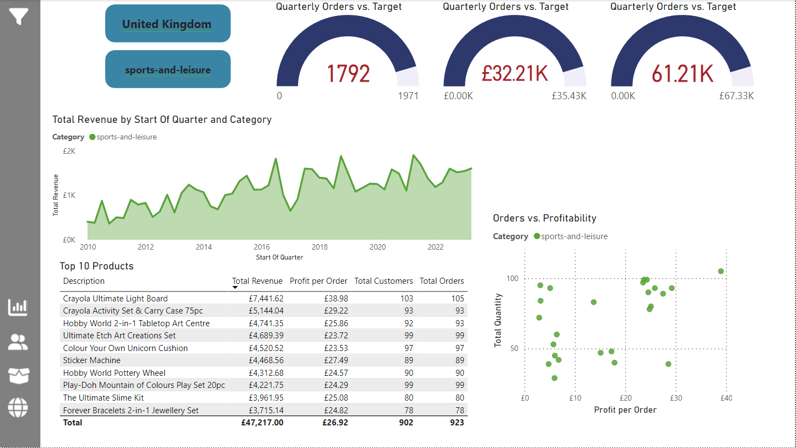

## Milestone 8 - Stores Map

This was a relatively simple page in comparison to the others. I had to make a map and add my geography hierarchy to it. I then added the bubble size to ProfitYTD. This made the Profit of each store show up as a relative bubble on the map. I added a simple country slicer above the map so the user could select either one country, or all countries. Here is the page:

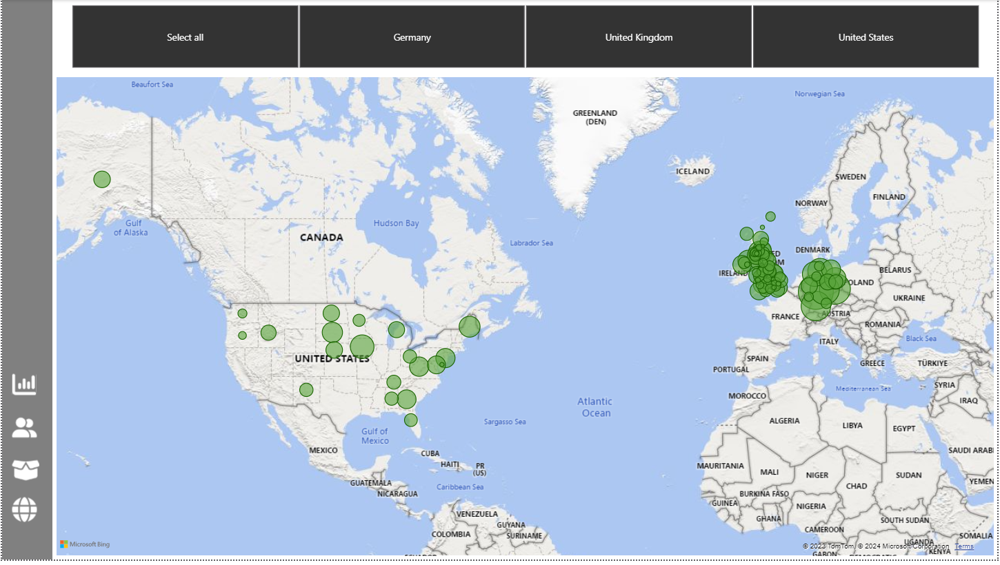

The next step was to create a stores drillthrough page, so the user can select a store from this map and information about the store can be shown. 

## Milestone 9

This just involved fixing the cross-filtering and navigation for each of the pages. Here are each of the changes I made:

### Executive Summary Page

The Top 20 Customers table does not filter any oter visuals. 

The Total Customers by Product donut chart does not affect the line graph.

The Total Customers by Country donut chart cross-filters the Total Customers by Product donut chart

### Customer Detail Page

The Product Category bar chart and Top 10 Products table should not filter the card visuals of KPIs. 

### Product Detail Page

Orders vs Profitability scatter graph does not affect any other visuals

Top 10 Products does not affect any other visuals

Finally, I had to setup the navigation bar. This was quite simple. I downloaded the pictures for each page. I first placed the white version of each button, and then went to the On Hover settings found in the format pane and put the cyan colour of the button.

This made it so the buttons would be cyan when you hover over them. Then I added an action to each button where pressing each one would take you to a certain page. Here is what it looks like when you hover over a button:

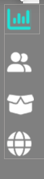

## Milestone 10

Here I had to query the database. I connected to the Postgres database server and got the data. I printed a list of the tables and columns in each table for my reference. Once I had this information, I completed each of the questions. All .sql and .csv files are present in the SQL folder in the repo.
